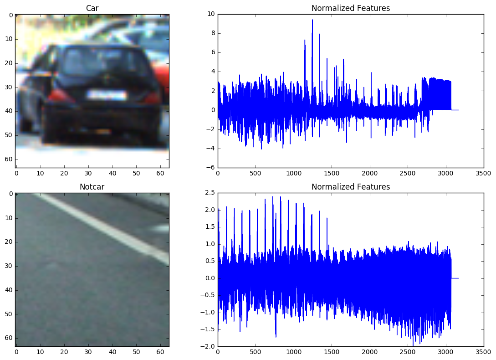
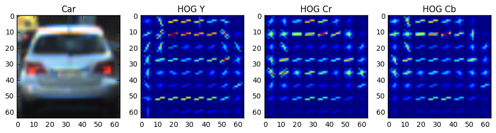
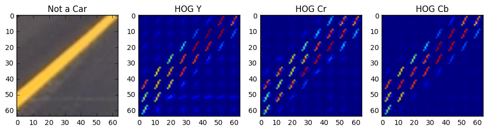
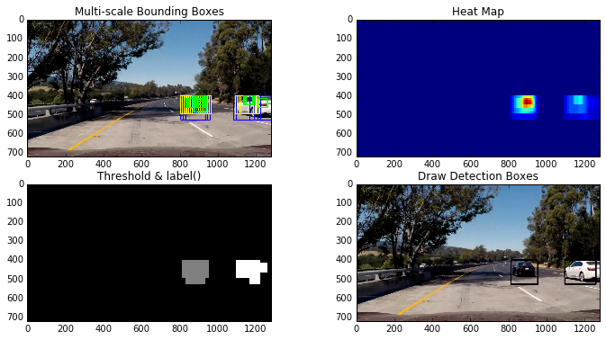

# P5: Vehicle Detection


In this project, we rely on computer vision techniques that explore spatial, color, and gradient features to detect vehicles in images captured from the front-mounted camera and track their positions across frames in a video. In particular, we implement the following techniques and tasks:

* Explore color spaces, histogram of colors, and spatial binning as features for a classifier.
* Explore Histogram of Oriented Gradients (HOG) as potentially useful feature extraction technique.
* Evaluate different classifier in combination with feature selections to strike a balance among high test accuracy, low false positive, and short run time. 
* Train with selected classifier and features on a labeled training set of images, with emphasis on normalizing features and randomizing a selection for training and testing.
* Implement a sliding-window technique and use trained classifier to search for vehicles in images.
* Create a heat map of recurring detections frame by frame to reject outliers and follow detected vehicles. Estimate a bounding box for vehicles detected.
* Run a pipeline on a video stream (project_video.mp4)


### Submitted Files

The main files include:

* features.py and features.pyc - the script that includes all the functions that implement different feature extractions. The functions in features.py will be called upon by train.py and pipeline.py.
* train.py - the script that trains the with selected classifier and features on a labeled training set of images.
* pipeline.py - the script that implements sliding-window technique, vehicle searching, outlier rejection with heat map, abd bounding box estimation to run on a video stream.
* mlp\_spa\_32\_hist32\_YCrCb\_o9\_p8\_c2\_chALL.p - pickle file that stores the classifier object.
* mlp\_scaler\_spa\_32\_hist32\_YCrCb\_o9\_p8\_c2\_chALL.p - pickle file that stores the feature scalers.
* sub\_projcet\_video.mp4  - the video file that shows the detection and tracking of the cars. 
* Test images provided by Udacity, saved in directory \test_images.. 

### My Approaches

These are the main steps that leads to the implementation of the final pipeline.

1. Feature exploration and evaluation
2. Classifier evaluation and training
3. Vehicle Detection, outlier rejection, and bounding box estimation.

#### Feature exploration and evaluation
The submitted file features.py include all the functions that related to feature extraction. I use the function provided by the course to extract the features.

```
extract_features(cars, color_space=color_space, 
                            spatial_size=spatial_size, hist_bins=hist_bins, 
                            orient=orient, pix_per_cell=pix_per_cell, 
                            cell_per_block=cell_per_block, 
                            hog_channel=hog_channel, spatial_feat=spatial_feat, 
                            hist_feat=hist_feat, hog_feat=hog_feat)
```
The function extract_feature calls three other functions to extract HOG features, binned color features, and color histogram features. 

```
get_hog_features(img, orient, pix_per_cell, cell_per_block, 
                        vis=False, feature_vec=True)

bin_spatial(img, size=(32, 32))  

color_hist(img, nbins=32, bins_range=(0, 256))                      
                        
```
The main challenge is to select the appropriate color space and features. After much trial and error, I decide to chose YCrCb color space and use binned color, color histogram, and HOG features. As to be shown later, the chosen color space and features, combined with classifier provide very high classification accuracy and very low false positive. In particular, I use the following parameters:

```
color_space = 'YCrCb' # Can be RGB, HSV, LUV, HLS, YUV, YCrCb
orient = 9  # HOG orientations
pix_per_cell = 8 # HOG pixels per cell
cell_per_block = 2 # HOG cells per block
hog_channel = "ALL" # Can be 0, 1, 2, or "ALL"
spatial_size = (32, 32) # Spatial binning dimensions
hist_bins = 32    # Number of histogram bins
spatial_feat = True # Spatial features on or off
hist_feat = True# Histogram features on or off
hog_feat = True # HOG features on or off
```
The following images show the comparison of the spatial and color binned normalized histogram between a "car" and "notcar". There are a total of  32x32x3+32x3=3168 features.


The following images compare the HOG features in Y, Cr, Cb channels between a "car' and "notcar". There are a total of 1764x3=5292 features.



In total, I use 3168+5292=8460 features, which provide very high classification accuracy and very low false positive in the final pipeline. The downside is longer run time during both training and detection.

### Classifier evaluation and training
I use the dataset provided by the course. The example images come from a combination of the GTI vehicle image database, the KITTI vision benchmark suite, and examples extracted from the project video itself. I shuffle and split the dataset into training and test sets with a 80%/20% ratio. I also regularize the data using scikitlearn's StandardScalar, as suggested in the lecture. The script train.py contains all the code for training classifiers.

For classifier, I first use scikitlearn's LinearSVC as instructed by the lectures. The test accuracy is around 98.3%. I also use scikietlearn's Multi-layer Perception classifier (fully connected neural net) MLPClassifier and achieve a test accuracy of 99.3%. Since higher accuracy and low false positive is very important, I decided to use the MLPClassifier in the pipeline. The training is straight forward:

```
rand_state = np.random.randint(0, 100)
X_train, X_test, y_train, y_test = train_test_split(
        scaled_X, y, test_size=0.2, random_state=rand_state)
mlp=MLPClassifier(random_state=54321)
mlp.fit(X_train, y_train)
```
In addition, I make use of the MLP classifier's method predict_proba which returns a probability score for each possible class. I chose to threshold my predictions by looking for windows which were classified as vehicle with a probability score higher than 0.99. This approach greatly reduces the false positive.

I save the classifier and scaler results in mlp\_spa\_32\_hist32\_YCrCb\_o9\_p8\_c2\_chALL.p and  mlp\_scaler\_spa\_32\_hist32_YCrCb\_o9\_p8\_c2\_chALL.p, respectively.

### Vehicle Detection, Outlier Rejection, and Bounding Box Estimation
I include the code that implements sliding window approach in features.py and pipeline.py. To search for vehicles within images,  I use multi-scale sliding window approach where I look at one region of interest (represented by a box) of the image at a time and make prediction if there is car. I use four windows in this project: 48x48, 96x96, 128x128, 256x256.  To minimize the search area and speed up the pipeline, I specify the different areas to searched for different window sizes. In particular, I use a Python dictionary data structure to store the specifications for each window (size, search range in x an y directions, and colors of the boxes):

```
multi_window={}
multi_window['max']=[(256, 256),[200, None],[400,720],(255,0,0)]
multi_window['min']=[(48, 48),[200, None],[400,500],  (0, 255,0)]
multi_window['mid1']=[(128, 128),[200, None],[400,720],(0,0,255)]
multi_window['mid2']=[(96, 96),[200, None],[400,720],(255,255,0)]
```
I also use a 80% and 65% overlap in x and y directions, respectively, to achieve a trade off between accuracy and run time.

I use the following function to detect the car (in features.py).

```
search_windows(img, windows, clf, scaler, color_space='RGB', 
                    spatial_size=(32, 32), hist_bins=32, 
                    hist_range=(0, 256), orient=9, 
                    pix_per_cell=8, cell_per_block=2, 
                    hog_channel=0, spatial_feat=True, 
                    hist_feat=True, hog_feat=True)
```
For each box that represents an area of the input frame, I first resize each box to 64x64 to match the feature input size of the classifier. I then extract the features from this image. These features are then normalized using the StandardScalar. As previously mentioned, I  use MLP classifier's method predict_proba to predict the probability of detection. I also set a detection threshold to 0.99 to reduce false positive.

```
if mlp.predict_proba(test_features)[0][1] > .99:    
            on_windows.append(window)
```
After I obtain all the bounding boxes for which the classifier reports positive detections, I use the heat map approach to combine overlapping detections and to remove possible false positives. The script features.py has all the related code. Specifically, I use ```add_heat(heat map, bbox_list)``` function to build up the heat map. I then use ```apply_threshold(heat map, threshold) ``` to remove possible false positives. I next use ```label()``` function from ```scipy.ndimage.measurements``` to find the number of cars detected. Finally I use ```draw_labeled_bboxes(img, labels)``` to put the  bounding boxes on the detected cars. The process is illustrated in the following images:

### Pipeline and Final Results
To track vehicles across frames in a video stream, I create a class Box to store all of the bounding rectangles from each of the previous ten previous frames. The function ```pipeline()``` implements all the tracking pipeline. Before testing on the video, I run the ```pipeline()``` on a sequence of images to evaluate the performance.  The final video files are included in the submitted files. A YouTube link is also provided: 
[Processed project video](https://youtu.be/Sn61JonT0dw)

### Discussion and Future Improvement
The most challenging part of this project is the selection of a set of features and a classifier that can strike a balance among the competing objectives such as increasing detection accuracy, reducing the false positive, and shortening the run time. After much effort, my pipeline is finally false-positive-free for the duration of the video.

The downside of using all the features (8460 in total) provided and multi-scale search windows is that my pipeline runs very slowly at a few seconds per frame. This is probably fine for a course project but definitely inadequate for real-time autonomous driving.  I plan to reduce the number of features and the number of windows searched to evaluate the potential of speed up. I also plan to evaluate if using parallel processing architecture (multi-thread, multi-core, and GPU) can produce significant speed up.